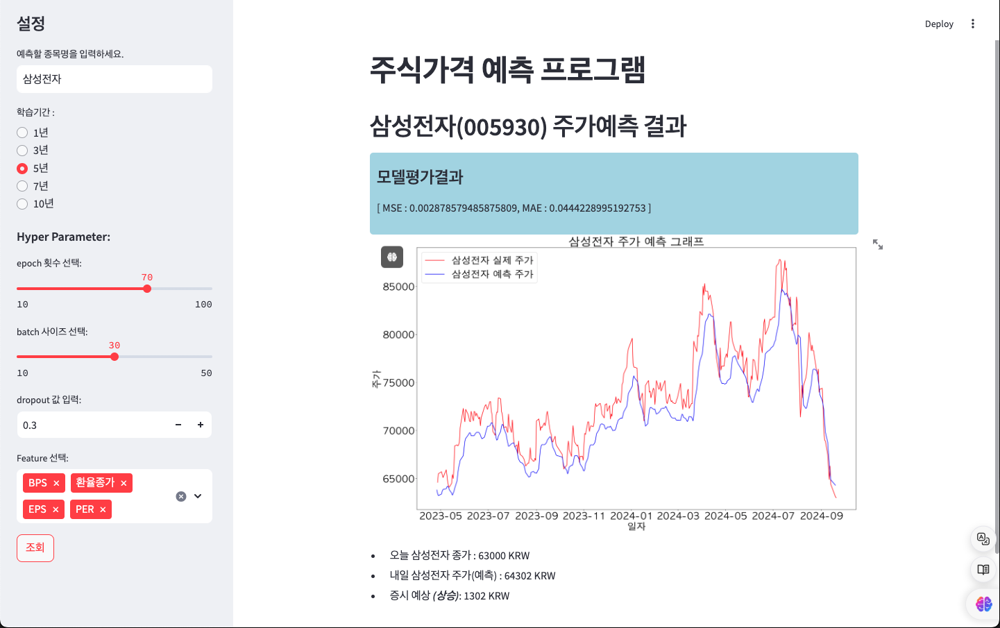

# AI 기반 주가예측 프로그램

-------

## 1. 개요

본 프로젝트는 AI 전문가 과정의 일환으로 파일럿프로젝트로 수행하였다.
프로젝트를 위해 위키독스의 [금융 데이터 분석을 위한 파이썬](https://wikidocs.net/173005) 문서를 기반으로 작성하였고, 이를 개선시키는 방향으로 처리하였다.

### 1.1. 개선사항

- Deep Learing을 위해 사용하는 데이터를 주가시세 데이터 외에 종목기초정보와 환율데이터를 사용하도록 추가
- tensorflow를 사용했던 코드를 pytorch를 사용하도록 수정
- streamlit을 사용하여 시각화
- 사용자가 변경할 수 있는 hyper-parameter를 수정가능하도록 처리

### 1.2. 사용 라이브러리

- 주식시세 및 환율정보 수집 : [pykrx](https://github.com/sharebook-kr/pykrx), [yfinance](https://pypi.org/project/yfinance/)
- Deep Learning Library : pytorch
- 데이터 전처리 및 모델평가 : scikit-learn, pandas, numpy
- 시각화 및 사용자 UI : matplotlib, streamlit

